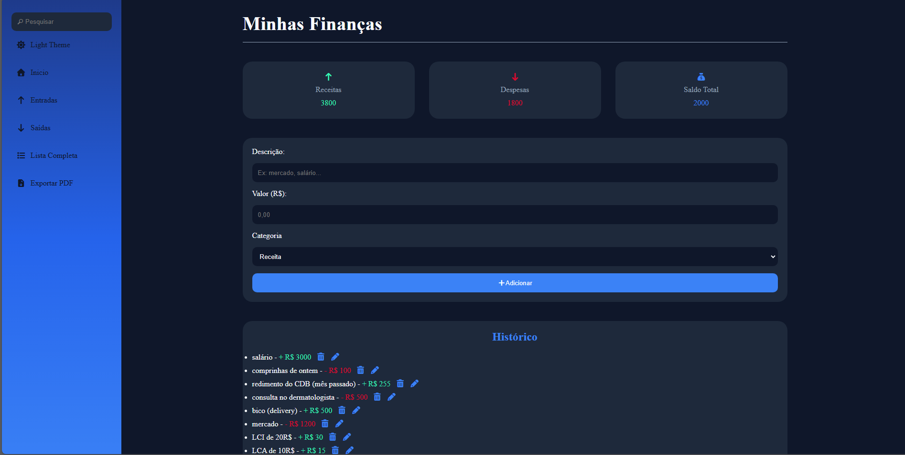

# 💰 Sistema de Gastos Financeiros

Aplicação web para controle de receitas, despesas e saldo total, permitindo registrar transações, editar, excluir, filtrar movimentações e exportar relatórios em PDF.

## 🚀 Demonstração

🔗 Acesse o projeto:
https://nicole-m0.github.io/Sistema_Gastos-Financeiros/

## 📸 Funcionalidades

- ✅ Adicionar receitas e despesas
- ✅ Editar transações
- ✅ Excluir transações
- ✅ Cálculo automático do saldo
- ✅ Filtro por entradas e saídas
- ✅ Persistência de dados com LocalStorage
- ✅ Exportação de relatório em PDF
- ✅ Dark Mode
- ✅ Layout responsivo

## 🛠️ Tecnologias Utilizadas

<p align="left">
  
</p>

## 📂 Como Executar

```bash
git clone https://github.com/Nicole-M0/Sistema_Gastos-Financeiros.git
```

Abra o arquivo `index.html` no navegador ou utilize a extensão **Live Server** do VS Code.

--- 

<p align="center">
  
</p>
